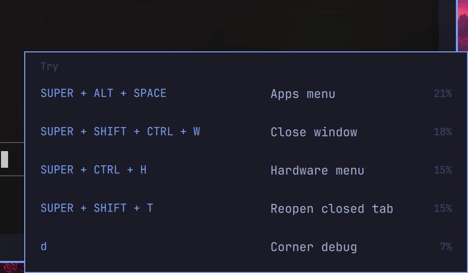

# omarchy-mouse-sacrifice

Bottom-right corner assistant for [Omarchy](https://omarchy.org/). Move the pointer into the corner and it offers up to five commands that fit what is on screen.

The card in this screenshot opens in the bottom-right corner.



The plugin id is `ignotas.mouse-sacrifice`. License: MIT. It needs the `secret-tool` that ships with Omarchy, and your own Jev key.

## What it sends

The plugin keeps its working notes on this machine, under `~/.local/state/omarchy/mouse-sacrifice/`. That directory holds the press log, the last card, the unused-suggestion counts, and the spend tally. The plugin needs those files to work. It never shares them, and it never will. They stay on this machine.

Jev (TypeSafe) only ranks a list. The plugin builds the list in code:

- the focused window's app and a short title
- up to six other windows on that workspace
- every widget on the top bar, left to right, and a bar click such as `opened wifi`
- the last five things you used, newest first: a window's class name, or a panel you opened, such as wifi or calendar
- every real Hyprland shortcut the keyboard can press, each with its keys, what it does, and how often you pressed it

A shortcut Hyprland marks `locked` stays off that list. Those are the hardware keys that still work on the lock screen, such as the power button, volume, and brightness. `Super+Ctrl+P` is the power panel, and it stays available.

No screenshot and no typed text go out. One call asks two Choice questions when nothing is saved yet, and again when the set of five names changes. It also runs again when you press one of the five suggested shortcuts twice after that ranking. Presses from before the ranking do not count. The same five names, with none of those shortcuts pressed twice, are not sent again. An identical request inside a minute is free.

The `apps` question is the shortcuts that match those five names. On the card, each name's matches are scaled to their own 100%, and the highest of those shares are offered. A shortcut that fits more than one name keeps its best share.

The `explore` question is every other shortcut. That pool leaves the five names' shortcuts out, and both pools are ranked again when that set changes. `uses`, `hour`, and `ago` stay on every shortcut in both questions. The card leads with the per-app shares. The exploration pool fills the card when fewer than five match, and it sits behind them so a rested app shortcut can reveal one.

The newest desktop action puts the shortcut that would have done the same thing first. Opening wifi puts Network first. Closing a window puts Close window first. Switching to workspace 2 puts Switch to workspace 2 first. Focusing a window does not. That choice stays on this machine and does not start another call. A shortcut with no saved share keeps a blank percent, and it still leads when it had been set aside.

The call is `POST https://api.typesafe.ai/v1/systemone`. The body is JSON in this shape. The names below are an example, so you can see the fields. Your key is only the `Authorization: Bearer` header, taken from the login keyring.

```json
{
  "model": "jev-latest",
  "state": {
    "focused": {
      "app": "Alacritty",
      "title": "mouse-sacrifice",
      "floating": false,
      "fullscreen": false
    },
    "workspace": "1",
    "also_visible": [
      {"app": "chromium", "title": "Inbox"}
    ],
    "just_did": ["opened wifi", "focused Alacritty"],
    "recent_apps": ["Alacritty", "chromium"],
    "bar": ["menu", "workspaces", "calendar", "wifi", "audio", "power"]
  },
  "questions": {
    "apps": {
      "type": "choice",
      "instructions": "Which shortcut for the recent apps and panels should be offered next? uses is every press kept, hour is presses in the last hour, and ago is minutes since the last press, snapped to 0, 5, 15, 60, 180, 720, 1440, 4320, 10080, 43200, or 129600. A large ago means they knew this shortcut and may have forgotten it, so it can lead again when the screen fits. `just_did` includes recent window changes and bar actions such as `opened wifi` or `opened calendar`. `bar` is every widget on the top bar, left to right, not only wifi and the calendar. `web` is the site a shortcut opens. The same name without `web` is the local panel. `recent_apps` is the last apps used, newest first, with no titles. Give a shortcut used heavily and recently almost no probability unless the screen clearly needs it again. When those are the ones they know, put the probability on unused shortcuts that fit the screen, so a few new ones lead. If none of the shortcuts fit, spread probability evenly.",
      "criteria": {
        "3": {
          "chord": "SUPER + RETURN",
          "does": "Terminal",
          "uses": 9,
          "hour": 2,
          "ago": 15
        }
      }
    },
    "explore": {
      "type": "choice",
      "instructions": "Which shortcut should be offered for exploration? None of these belong to the recent apps and panels. uses is every press kept, hour is presses in the last hour, and ago is minutes since the last press, snapped to 0, 5, 15, 60, 180, 720, 1440, 4320, 10080, 43200, or 129600. A large ago means they knew this shortcut and may have forgotten it, so it can lead again when the screen fits. `just_did` includes recent window changes and bar actions such as `opened wifi` or `opened calendar`. `bar` is every widget on the top bar, left to right, not only wifi and the calendar. `web` is the site a shortcut opens. The same name without `web` is the local panel. `recent_apps` is the last apps used, newest first, with no titles. Give a shortcut used heavily and recently almost no probability unless the screen clearly needs it again. When those are the ones they know, put the probability on unused shortcuts that fit the screen, so a few new ones lead. If none of the shortcuts fit, spread probability evenly.",
      "criteria": {
        "11": {
          "chord": "SUPER + CTRL + ESCAPE",
          "does": "Lock system",
          "uses": 1,
          "ago": 1440
        }
      }
    }
  }
}
```

`hour` and `ago` are left out until the shortcut has been used. `web` is there only when the shortcut opens a site, and then it is the host alone. A shortcut with no presses is just `chord`, `does`, and `uses`.

Those five names, the recent actions, the last card, and both probability maps are kept in `~/.local/state/omarchy/mouse-sacrifice/history.json`. After a reboot the ranking comes back. The same five names are not sent to Jev again unless one of the five suggested shortcuts has been pressed twice since that ranking. A ranking saved before the exploration pool existed is sent once, so that pool can be stored.

## Cost

Jev charges input tokens only, at $0.042 per million. Output is free. Each reply's `usage.input_tokens` is added to `~/.local/state/omarchy/mouse-sacrifice/jev.json`. A cached open does not add a call.

The cost stays off the card until debug is on. Put the pointer in the corner and press D. That D is swallowed, and a small Pac-Man eats it. The same corner keeps the card open, so D is still swallowed while the pointer is on the card. The card closes in the same moment the pointer leaves it. D types normally again once it is gone. Press D there again to hide the cost. The choice is remembered in `~/.local/state/omarchy/mouse-sacrifice/debug`.

While debug is on, the card grows to the left and shows the last request built for Jev. On a Mac, that side also names the keys: ⌘ Command is Super, and ⌥ Option is Alt.

## Learning

Presses are counted per shortcut in `~/.local/state/omarchy/mouse-sacrifice/usage.jsonl` and are kept. The full call tells Jev how many times each shortcut was used, how many of those presses were in the last hour, and how long ago the last one was. A shortcut you used and then left alone can lead again. Shortcuts you use a lot right now leave room for ones you have not used. Those counts are sent to Jev when the five names change, and when one of the five suggested shortcuts is pressed twice after the last ranking. The card also applies them on its own: each press in the last hour takes a fifth of that shortcut's chance, and five presses set it aside until those presses leave the hour. A press still clears the ignored-display count, and the recent presses keep the shortcut down. If Jev does not answer, the previous ranking stays on the card. If there is no ranking yet, the card shows shortcuts you have not used.

Each time a shortcut is on the card and you do not use it, it loses a fifth of its chance. After five times it is fully aside, on the unused list in `unused.json`. That loss fades over a day from the last ignored display, so the shortcut can come back. Using it once clears that ignored-display count. Presses from the last hour are separate, and they stay until the hour passes. The list stays on this machine. It is not sent to Jev, and a repeated screen still reuses the cached answer.

Holding a key does not add extra presses. Plain typing is not recorded. D and Shift+D in the corner count as one shortcut, Corner debug.

## Key

Jev needs your own key. It is stored in the login keyring, the same way other Omarchy plugins store a token: `secret-tool`, secret on stdin, never in a file and never on a command line.

That key is not under the plugin's control. You create it, review it, and revoke it on the TypeSafe side. The plugin cannot do that for you. It only reads the copy you chose to store in the login keyring. Revoke the key at TypeSafe and the ranking call stops.

```bash
~/.config/omarchy/plugins/ignotas.mouse-sacrifice/bin/mouse-sacrifice-key
~/.config/omarchy/plugins/ignotas.mouse-sacrifice/bin/mouse-sacrifice-key status
~/.config/omarchy/plugins/ignotas.mouse-sacrifice/bin/mouse-sacrifice-key clear
```

`status` says whether a key is stored and does not print it. Removing the plugin does not remove the keyring item. Clear it with the command above, or with `secret-tool clear service ignotas.mouse-sacrifice key jev`.

Calls go to `POST https://api.typesafe.ai/v1/systemone` with model `jev-latest`.

## Install

```bash
omarchy plugin add https://github.com/ignotas/omarchy-mouse-sacrifice.git --enable
```

The shell loads `Service.qml` as a `keepLoaded` service. Click a row to run that shortcut. Move the pointer away to close the card.

The corner itself does not take clicks. Only the open card does.

## Remove

```bash
omarchy plugin remove ignotas.mouse-sacrifice
```

That removes the plugin files. It leaves the keyring item and `~/.local/state/omarchy/mouse-sacrifice`. Clear the key with `mouse-sacrifice-key clear` if you want that gone too.
